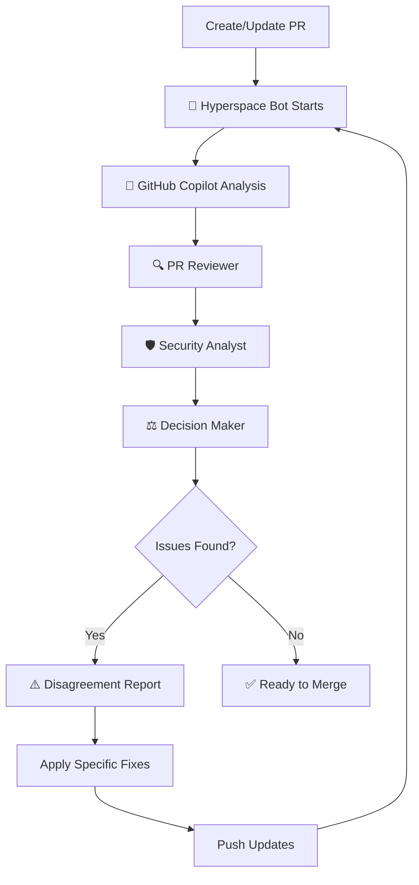

# 🚀 Hyperspace Bot - Quick Reference

## What Happens When You Create a PR?



## Comment Types

### 1. 🤖 GitHub Copilot Review
**What**: AI-powered security and quality scan
**Contains**:
- Security issues with exact line numbers
- Code quality improvements
- Complexity score
- Ready-to-apply code fixes

**Example**:
```javascript
File: srv/product-service.js
Line: 12
Fix: Add input sanitization
Time: 10 minutes
```

### 2. 🔍 PR Reviewer Analysis
**What**: Code quality and standards check
**Contains**:
- Standards compliance rating
- Maintainability score
- Approval readiness (X/10)

### 3. 🛡️ Security Analyst Report
**What**: Vulnerability and risk assessment
**Contains**:
- Security issues by severity
- Risk score (X/10)
- Quality gates status

### 4. ⚖️ Decision Maker Report
**What**: Final routing decision
**Contains**:
- Approval decision (APPROVED/APPROVE WITH SUGGESTIONS)
- Strengths and improvements
- Approval checklist

### 5. ⚠️ Disagreement Report (If Needed)
**What**: Conflicts between agents with specific fixes
**Contains**:
- Root cause analysis
- Exact file and line numbers
- Before/after code
- Implementation time estimate
- Files to modify list

## Labels Applied

| Label | Meaning |
|-------|---------|
| `hyperspace-analyzed` | Analysis complete |
| `ready-to-merge` | No issues found |
| `needs-fixes` | Action required before merge |
| `security-review` | Security issues detected |

## How to Apply Fixes

All fixes come with:
1. **Exact file path**: `srv/product-service.js`
2. **Line numbers**: Line 12-15
3. **Before code**: Current problematic code
4. **After code**: Fixed code (copy/paste ready)
5. **Time estimate**: 10-15 minutes
6. **Files to modify**: Complete list

### Example Fix Application

**Hyperspace Bot suggests**:
```javascript
// File: srv/product-service.js, Line 12

// BEFORE:
const { data } = req;

// AFTER:
const sanitizeInput = (input) => {
  if (typeof input === 'string') {
    return input.trim().replace(/[<>]/g, '').substring(0, 1000);
  }
  return input;
};

const sanitizedData = {
  ...req.data,
  name: sanitizeInput(req.data.name)
};
```

**You do**:
1. Open `srv/product-service.js`
2. Go to line 12
3. Copy the "AFTER" code
4. Replace existing code
5. Commit and push
6. Hyperspace Bot re-analyzes automatically

## Viewing Workflow Runs

1. Go to **Actions** tab in GitHub
2. Find "🚀 Hyperspace Bot - AI PR Analysis"
3. Click on the workflow run
4. View detailed logs

## Common Scenarios

### ✅ All Clear
```
🤖 Copilot: No issues
🔍 Reviewer: 9/10 score
🛡️ Security: 2/10 risk
⚖️ Decision: APPROVED

Label: ready-to-merge
```

### ⚠️ Minor Issues
```
🤖 Copilot: 1 security issue
🔍 Reviewer: 8/10 score
🛡️ Security: 5/10 risk
⚖️ Decision: APPROVE WITH SUGGESTIONS
⚠️ Disagreement: Specific fix provided

Label: needs-fixes
```

### 🔴 Major Issues
```
🤖 Copilot: 3+ security issues
🔍 Reviewer: 6/10 score
🛡️ Security: 8/10 risk
⚖️ Decision: Address findings first
⚠️ Disagreement: Multiple specific fixes

Labels: needs-fixes, security-review
```

## Time Estimates

- **Analysis**: < 5 minutes
- **Applying single fix**: 10-15 minutes
- **Applying multiple fixes**: 20-30 minutes
- **Re-analysis**: < 5 minutes (automatic)

## Tips

✅ **Do**:
- Apply suggested fixes exactly as shown
- Push updates to trigger re-analysis
- Check all disagreement reports
- Ask for help if fixes are unclear

❌ **Don't**:
- Ignore security findings
- Skip input sanitization
- Leave hardcoded values
- Merge with unresolved disagreements

## Questions?

- Check `.github/HYPERSPACE_BOT.md` for full documentation
- Review existing PR comments for examples
- Contact repository maintainers

---
🚀 **Powered by Hyperspace Bot**
