# PRo Agent Interaction & Communication Flow

## Overview

This document explains how the four PRo agents (workflows) interact, communicate, and coordinate to provide comprehensive PR analysis. While workflows run independently, they create a cohesive user experience through strategic timing, shared data sources, and complementary responsibilities.

---

## Agent Architecture

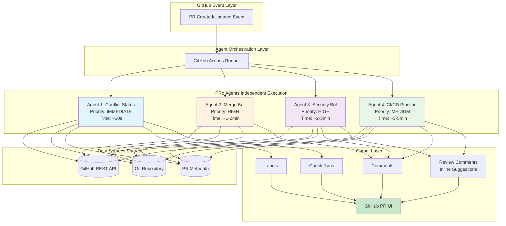

---

## Agent Communication Patterns

### **Pattern 1: No Direct Communication (Independent Agents)**

PRo agents do NOT communicate directly with each other. Instead, they:
1. All read from the same data sources (GitHub API, Git repo)
2. All write to the same destination (PR UI)
3. Execute independently and in parallel
4. Coordinate through **timing**, **priorities**, and **complementary responsibilities**

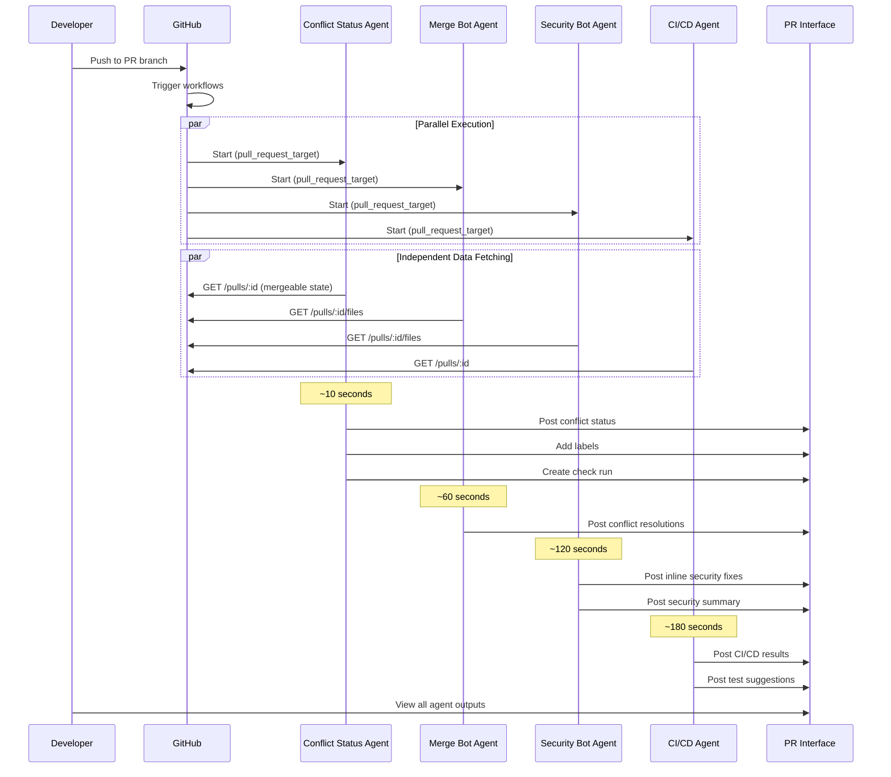

---

## Agent Interaction Matrix

| Agent | Reads From | Writes To | Depends On | Coordinates With |
|-------|-----------|-----------|------------|------------------|
| **Conflict Status** | GitHub API<br/>PR metadata | Labels<br/>Check runs<br/>Comments | None | None (fastest) |
| **Merge Bot** | GitHub API<br/>Git repository<br/>Conflict markers | PR Comments<br/>(collapsible sections) | None | Conflict Status (implicit via labels) |
| **Security Bot** | GitHub API<br/>PR files list<br/>Vulnerability DB | Review comments<br/>PR comments<br/>Inline suggestions | None | None |
| **CI/CD Pipeline** | GitHub API<br/>Source code<br/>Dependencies | Review comments<br/>PR comments<br/>Check runs | Build job → Other jobs | None |

---

## Agent Responsibilities & Handoffs

### Agent Responsibility Breakdown

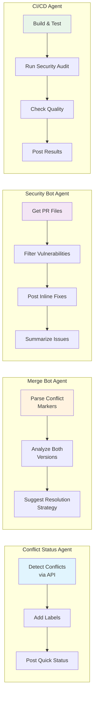

### Implicit Coordination (No Direct Communication)

**Scenario 1: Conflict Detection Handoff**

```
Conflict Status (10s) → Detects conflicts → Adds "merge-conflict" label
                                              ↓
Merge Bot (60s) → Reads same PR → Finds conflicts → Posts detailed resolution
                                              ↓
Developer → Sees both: Quick status + Detailed suggestions
```

**Scenario 2: Security Analysis Handoff**

```
Security Bot (120s) → Scans 5 files in PR → Posts 3 inline fixes
                                              ↓
CI/CD Agent (180s) → Scans same 5 files → Posts 2 additional suggestions
                                              ↓
Developer → Sees combined: Security fixes + Quality improvements
```

---

## Data Flow & Shared Resources

### Shared Data Sources (Read-Only)

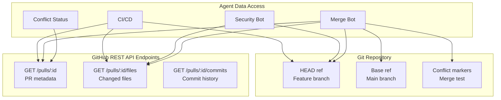

### Output Destinations (Write-Only)

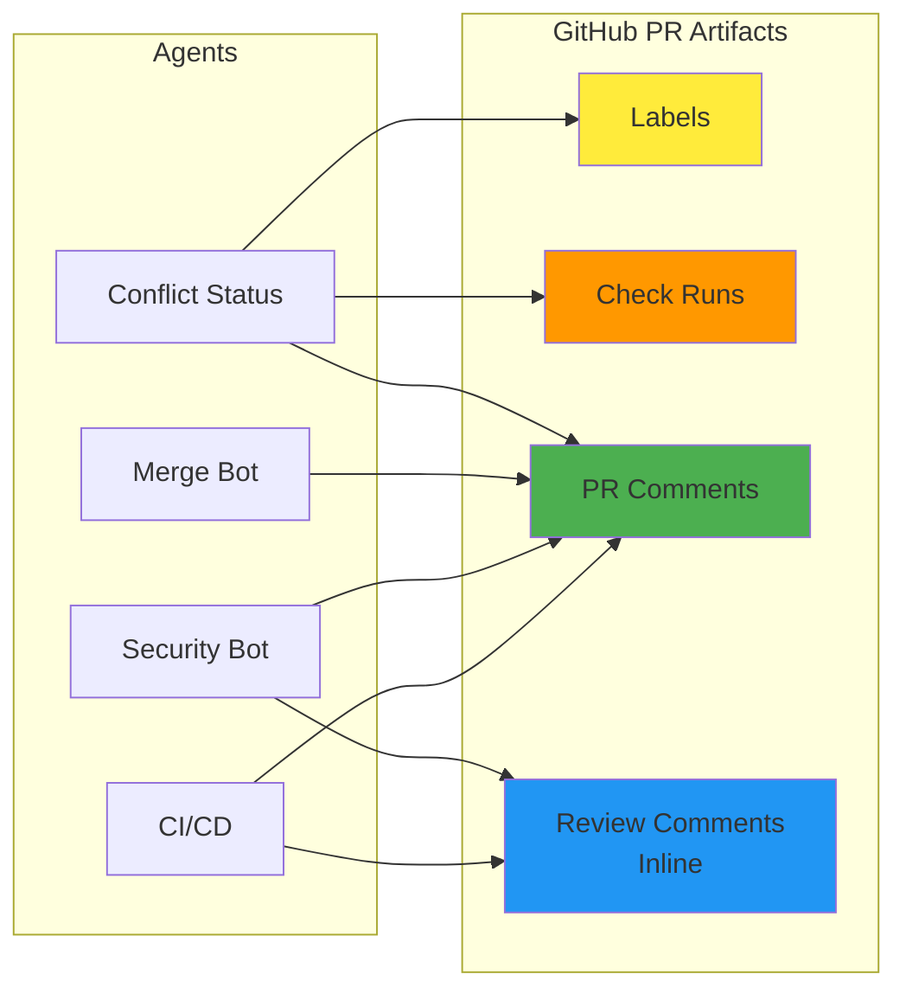

---

## Agent State Machine

### Conflict Status Agent State Machine

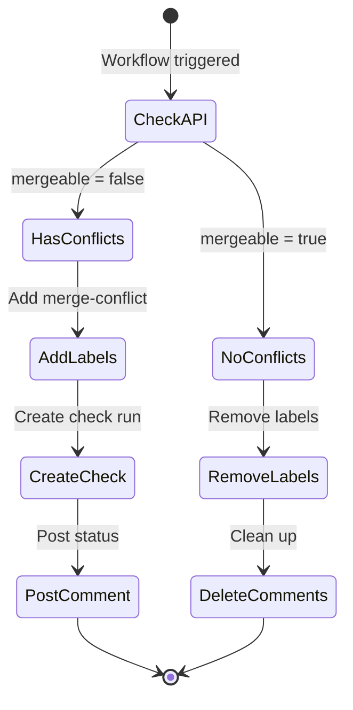

### Merge Bot Agent State Machine

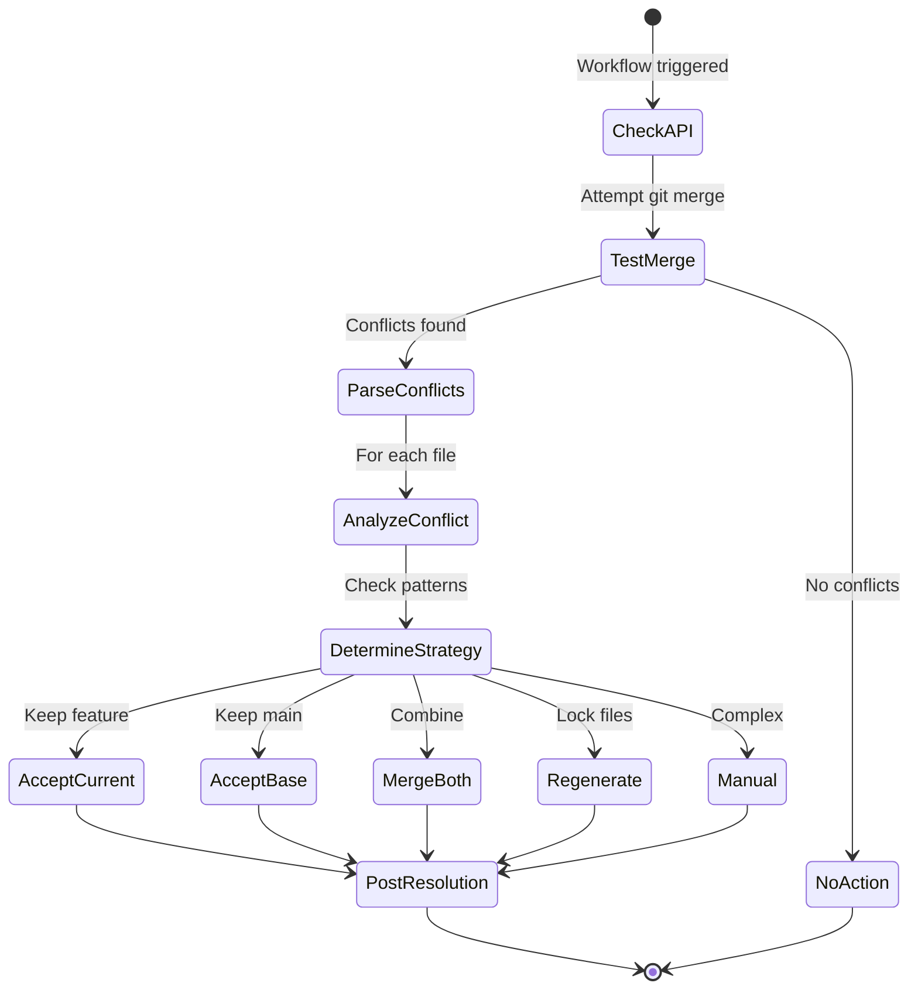

### Security Bot Agent State Machine

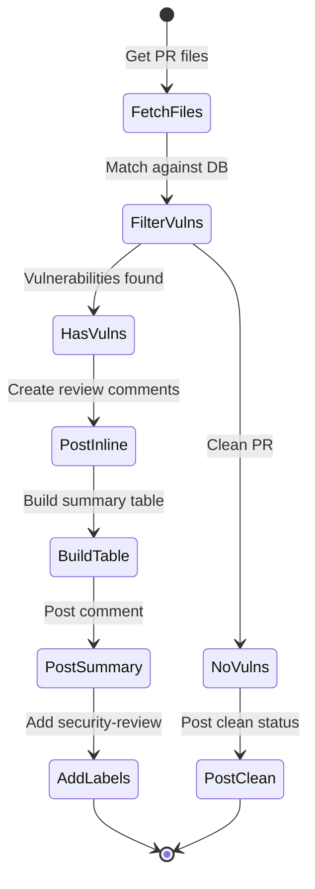

### CI/CD Agent State Machine

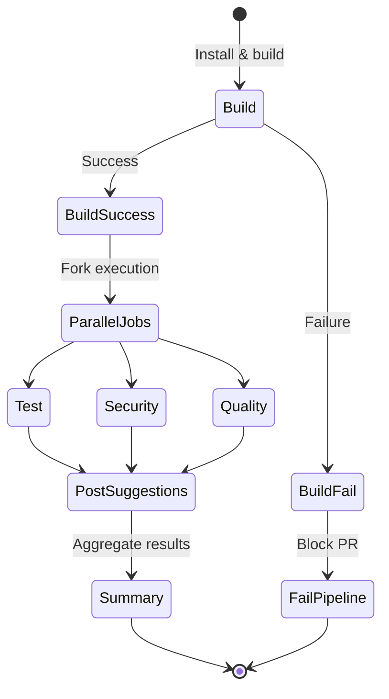

---

## Timing & Priority Orchestration

### Agent Execution Timeline

```
Time  | Agent                  | Action                                    | User Visibility
------|------------------------|-------------------------------------------|------------------
0s    | GitHub                 | PR event triggers all 4 workflows         | Loading...
1s    | All Agents             | Checkout code, setup environment          | Loading...
5s    | Conflict Status        | API check complete                        | 
10s   | ✅ Conflict Status      | Comment posted, labels added              | "🔍 Detecting..."
20s   | Merge Bot              | Git merge test complete                   |
30s   | Security Bot           | Files fetched, vulnerabilities filtered   |
40s   | CI/CD                  | Dependencies installed                    |
60s   | ✅ Merge Bot            | Conflict resolutions posted               | "🔀 Conflicts found"
90s   | CI/CD                  | Build complete, tests running             |
120s  | ✅ Security Bot         | Security analysis posted                  | "🛡️ 5 issues found"
150s  | CI/CD                  | Security scan complete                    |
180s  | ✅ CI/CD                | All jobs complete, summary posted         | "✅ Build passed"
```

### Priority Levels

| Priority | Agent | Reason | Target Time |
|----------|-------|--------|-------------|
| **IMMEDIATE** | Conflict Status | Developers need to know about conflicts ASAP | 10s |
| **HIGH** | Merge Bot | Detailed conflict resolution is critical | 60s |
| **HIGH** | Security Bot | Security issues should block unsafe merges | 120s |
| **MEDIUM** | CI/CD | Comprehensive testing takes time | 180s |

---

## Agent Communication via Shared Context

### GitHub PR as Shared Blackboard

Agents use the PR as a "blackboard" - a shared space where they write information that others can read:

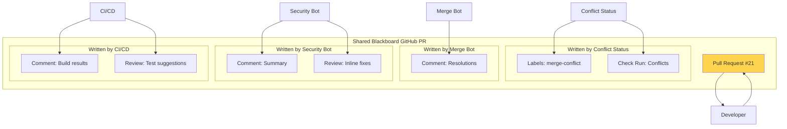

### Example: Implicit Agent Coordination

**Scenario: PR with security vulnerabilities in conflicted file**

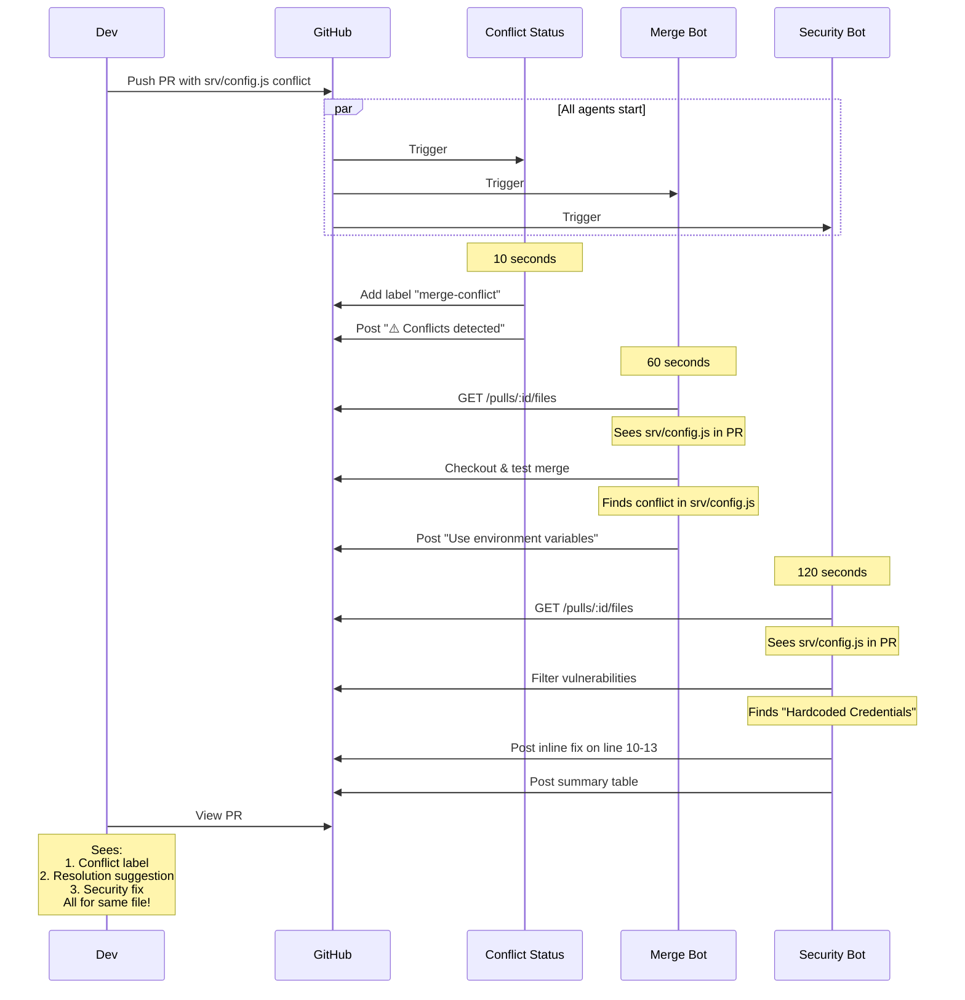

---

## Agent Data Processing Pipeline

### Each Agent's Internal Pipeline

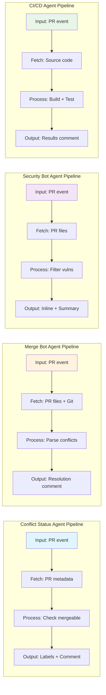

---

## Decision Trees for Agent Actions

### Conflict Status Agent Decision Tree

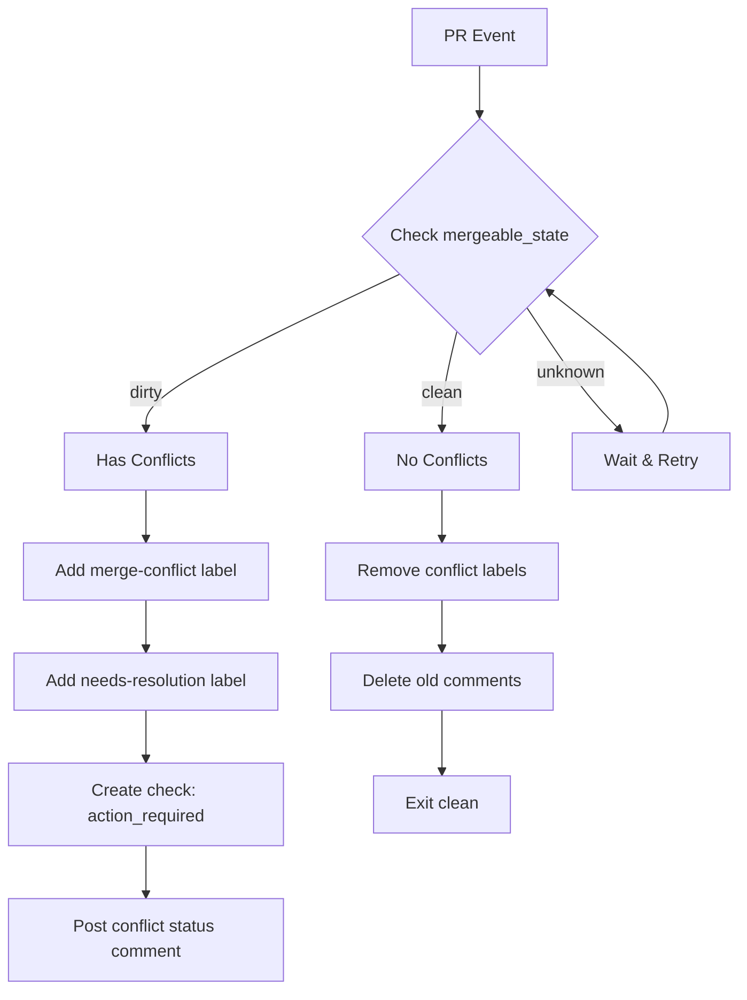

### Merge Bot Resolution Strategy Decision Tree

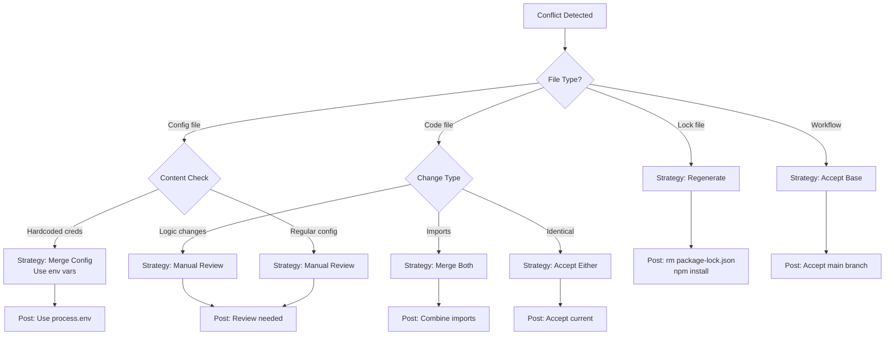

### Security Bot Filtering Decision Tree

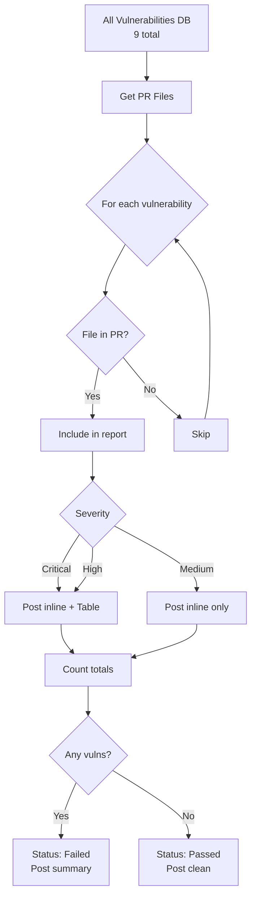

---

## Agent Output Aggregation

### How Outputs Combine in PR UI

```mermaid
graph TB
    subgraph "GitHub PR Interface"
        subgraph "Conversation Tab"
            C1[Comment: Conflict Status]
            C2[Comment: Merge Resolutions]
            C3[Comment: Security Summary]
            C4[Comment: CI/CD Results]
        end
        
        subgraph "Files Changed Tab"
            F1[Review: Security inline fixes]
            F2[Review: Test suggestions]
        end
        
        subgraph "Checks Tab"
            CH1[Check: Conflict Status]
            CH2[Check: Build]
            CH3[Check: Tests]
            CH4[Check: Security Scan]
        end
        
        subgraph "Labels Sidebar"
            L1[merge-conflict]
            L2[needs-resolution]
            L3[security-review]
            L4[pro-analyzed]
        end
    end
    
    A1[Conflict Status] --> C1
    A1 --> CH1
    A1 --> L1
    A1 --> L2
    
    A2[Merge Bot] --> C2
    
    A3[Security Bot] --> C3
    A3 --> F1
    A3 --> L3
    
    A4[CI/CD] --> C4
    A4 --> CH2
    A4 --> CH3
    A4 --> CH4
    A4 --> F2
    A4 --> L4
    
    style C1 fill:#e1f5fe
    style C2 fill:#fff3e0
    style C3 fill:#f3e5f5
    style C4 fill:#e8f5e9
```

---

## Error Handling & Resilience

### Agent Failure Scenarios

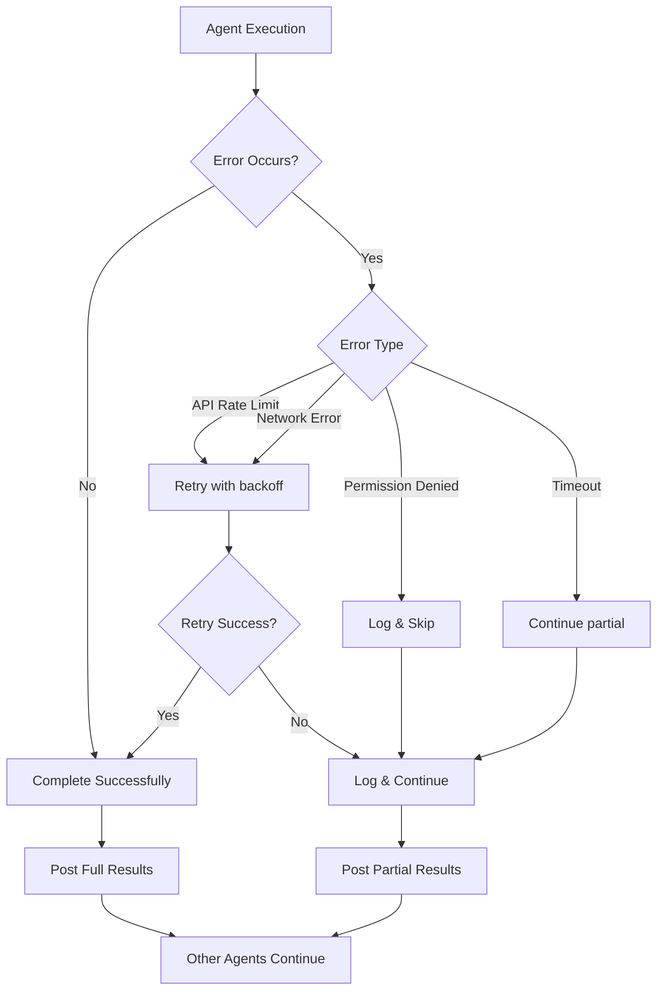

**Key Principle**: One agent failure does NOT affect other agents

Example:
```
Security Bot fails → ❌ No security analysis posted
                    → ✅ Conflict Status still works
                    → ✅ Merge Bot still works
                    → ✅ CI/CD still works
```

---

## Agent Interaction Summary

### Communication Model: **Shared Nothing, Coordinated Timing**

| Aspect | Implementation |
|--------|----------------|
| **Direct Communication** | ❌ None - agents don't call each other |
| **Shared Memory** | ❌ None - no shared state |
| **Shared Data Sources** | ✅ GitHub API, Git repo |
| **Shared Output Space** | ✅ PR comments, labels, checks |
| **Coordination** | ✅ Via timing and priorities |
| **Failure Isolation** | ✅ One failure doesn't affect others |

### Why This Architecture?

✅ **Resilience**: One agent failure doesn't cascade  
✅ **Scalability**: Add new agents without modifying existing ones  
✅ **Simplicity**: No complex orchestration logic  
✅ **Performance**: Parallel execution for speed  
✅ **Testability**: Each agent can be tested independently  

---

## Future Agent Interactions

### Potential Future Enhancements

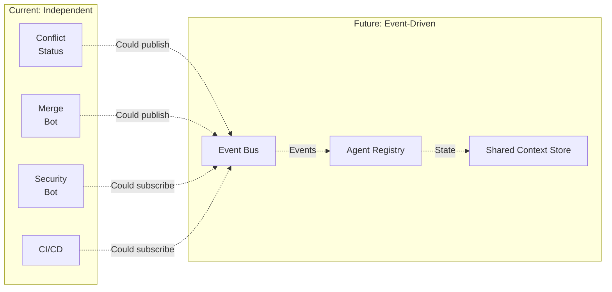

**Possible Future Patterns**:
- Event-driven: Agents publish/subscribe to events
- Shared state: Centralized context store
- Agent chaining: Output of one feeds into another
- Dynamic agents: Spawn agents based on PR content

---

## Conclusion

PRo uses a **decentralized, parallel agent architecture** where:

1. **No Direct Communication**: Agents operate independently
2. **Shared Data Sources**: All read from GitHub API and Git
3. **Shared Output Space**: All write to PR UI
4. **Timing Coordination**: Fast agents run first, slow agents run last
5. **Failure Isolation**: One agent failure doesn't affect others

This creates a **resilient, scalable, and performant** PR analysis system that provides comprehensive feedback while maintaining simplicity.

---

**Version**: 1.0.0  
**Last Updated**: 2026-04-16  
**Related Docs**: [PRO_WORKFLOW_ARCHITECTURE.md](./PRO_WORKFLOW_ARCHITECTURE.md)
