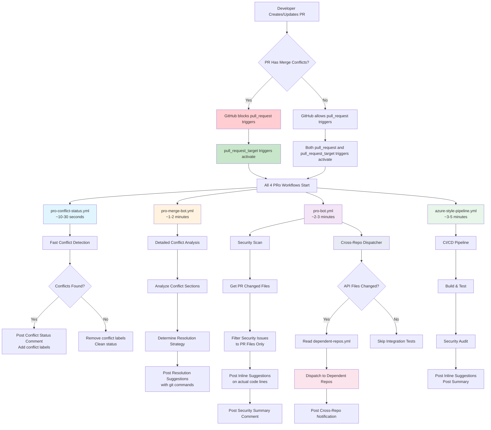
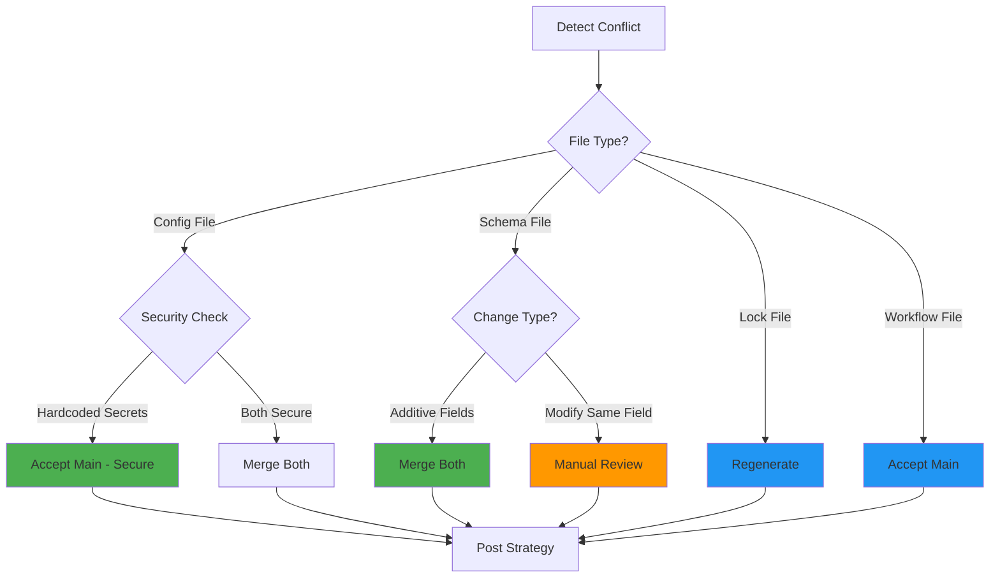
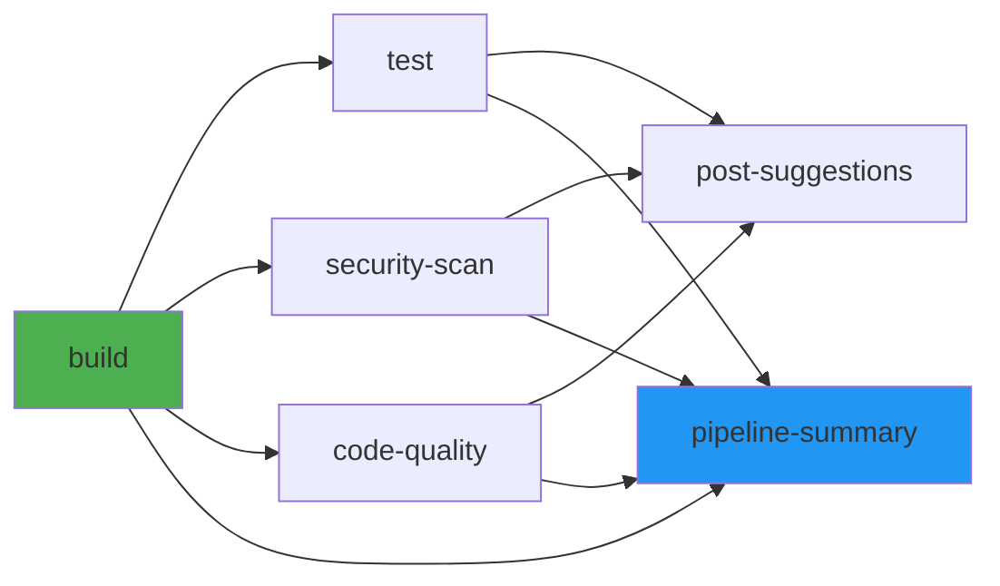
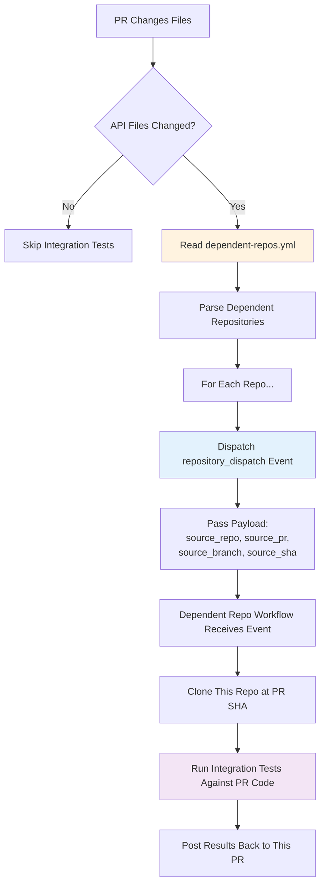
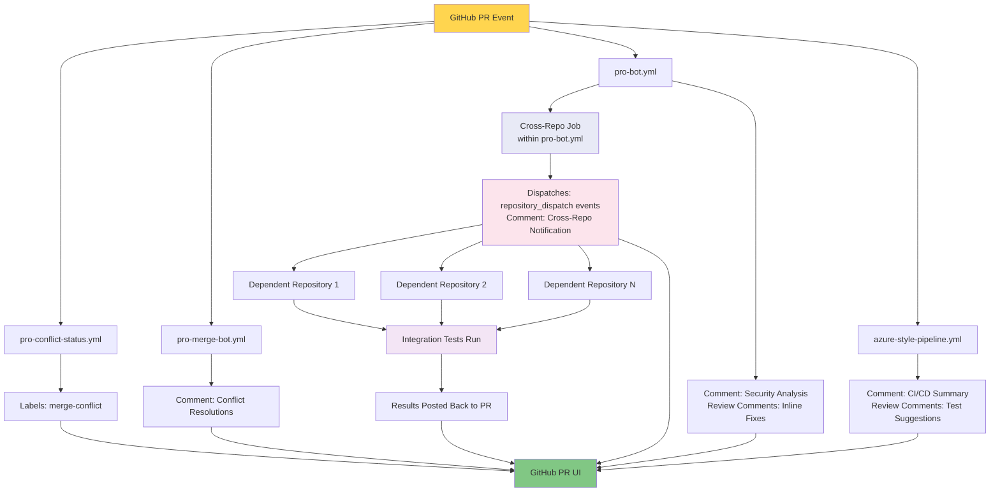

# PRo (PR Optimiser) Workflow Architecture

## Overview

PRo is an automated PR analysis system that provides security scanning, code quality checks, and intelligent merge conflict resolution. It consists of four coordinated GitHub Actions workflows that work together to analyze pull requests and provide actionable feedback with inline commit suggestions.

**Key Innovation**: PRo uses a dual-trigger strategy (`pull_request` + `pull_request_target`) to ensure workflows run even when PRs have merge conflicts, when GitHub normally blocks `pull_request` triggers.

---

## Workflow Trigger Flow



---

## Workflow Details

### 1. **pro-conflict-status.yml** - Fast Conflict Detection ⚡

**Purpose**: Provide immediate feedback (10-30 seconds) when merge conflicts exist

**Triggers**:
- `pull_request_target` events: `opened`, `synchronize`, `reopened`
- **Note**: Only uses `pull_request_target` for maximum speed and reliability

**Execution Time**: ~10-30 seconds

**Key Steps**:
1. **Check mergeable state** via GitHub REST API (`pulls.get`)
2. **Conditional logic**:
   - If `mergeable === false`: Conflicts detected
   - If `mergeable === true`: No conflicts
   - If `mergeable === null`: GitHub still computing (wait and retry)
3. **Add labels**: `merge-conflict`, `needs-resolution`
4. **Create check run** with `action_required` status
5. **Post notification comment** with immediate status

**Why Single Trigger?**
- Optimized for speed - runs from base branch context
- Has access to secrets via `pull_request_target`
- No checkout needed - uses API calls only
- Bypasses GitHub's workflow blocking on conflicts

**Output Example**:
```markdown
🔍 PRo Conflict Detection

⚠️ This PR has merge conflicts with the base branch

**Status**: action_required
**Files with conflicts**: 1
**Next steps**: Review detailed conflict analysis below
```

---

### 2. **pro-merge-bot.yml** - Intelligent Merge Conflict Resolution 🔀

**Purpose**: Provide detailed conflict analysis with strategy-based resolution suggestions

**Triggers**:
- `pull_request_target` (runs even with conflicts)
- `pull_request` (runs when no conflicts)
- Events: `opened`, `synchronize`, `reopened`

**Execution Time**: ~1-2 minutes

**Key Steps**:
1. **Checkout repository** from PR head ref with full history (`fetch-depth: 0`)
2. **Verify mergeable state** via GitHub API
3. **Attempt test merge**: `git merge --no-commit --no-ff origin/main`
4. **Parse conflict markers** if merge fails:
   ```
   <<<<<<< HEAD (current branch)
   Feature branch code
   =======
   Main branch code
   >>>>>>> origin/main
   ```
5. **Analyze conflict context**:
   - File type (config, schema, workflow, lock file)
   - Code semantics (security implications, data model changes)
   - Change patterns (additions vs modifications)
6. **Determine resolution strategy** (see strategy matrix below)
7. **Generate resolution suggestions**:
   - Recommended approach with rationale
   - Exact code to use
   - Copy-paste ready git commands
8. **Post comprehensive comment** with collapsible sections per file

**Resolution Strategy Matrix**:

| File Type | Condition | Strategy | Rationale |
|-----------|-----------|----------|-----------|
| `srv/config.js` | Feature has hardcoded credentials, Main has env vars | `merge-config` (accept main) | Security: prefer environment variables over hardcoded secrets |
| `db/schema.cds` | Both add different fields to same entity | `merge-both` | Data model: both fields are additive, can coexist |
| `package-lock.json` | Version conflicts | `regenerate` | Lock files: always regenerate from package.json |
| `.github/workflows/*.yml` | Workflow definition conflicts | `accept-base` (main) | CI/CD: prefer tested main branch workflows |
| `*.test.js` | Test conflicts | `merge-both` | Tests: usually independent, merge when possible |
| Complex logic conflicts | Cannot determine safe merge | `manual` | Requires human review and understanding |

**Real Example from Test Scenario**:

Current test branch has this conflict in `db/schema.cds`:
- **Main branch**: Added `minStock: Integer default 5;` (minimum threshold for reordering)
- **Feature branch**: Added `maxStock: Integer default 1000;` (maximum warehouse capacity)
- **Resolution**: `merge-both` - Both fields are independent and additive

**Resolution Suggestion Format**:
```markdown
<details>
<summary>📄 db/schema.cds (Line 23) - ✅ SAFE TO MERGE BOTH</summary>

### Conflict Analysis
**Your Changes (Feature Branch)**:
- Added `maxStock` field for warehouse capacity tracking

**Main Branch Changes**:
- Added `minStock` field for reorder threshold

**Recommended Strategy**: `merge-both` ✅

Both changes are **additive and independent**. They can safely coexist.

### Resolution Code
```cds
entity Products : managed, cuid {
  name        : String(100) @mandatory;
  description : String(500);
  price       : Decimal(10, 2) @mandatory;
  currency    : String(3) default 'USD';
  stock       : Integer default 0;
  minStock    : Integer default 5;    // From main - reorder threshold
  maxStock    : Integer default 1000; // From feature - warehouse capacity
  category    : Association to Categories;
  supplier    : Association to Suppliers;
  isActive    : Boolean default true;
}
```

### Git Commands
```bash
# Accept both changes
git checkout --theirs db/schema.cds
# Manually edit to include both fields (see code above)
git add db/schema.cds
git commit -m "fix: merge both minStock and maxStock fields"
git push
```

</details>
```

**Conflict Resolution Workflow**:



---

### 3. **pro-bot.yml** - Security Vulnerability Scan 🛡️

**Purpose**: Comprehensive security analysis with inline, committable fix suggestions

**Triggers**:
- `pull_request_target` (runs even with conflicts)
- `pull_request` (runs when no conflicts)
- Events: `opened`, `synchronize`, `reopened`

**Execution Time**: ~2-3 minutes

**Key Innovation**: File-filtered vulnerability detection - only shows issues for files actually changed in the PR

**Workflow Steps**:

1. **Checkout repository** with full history
2. **Get PR changed files** via GitHub REST API:
   ```javascript
   const { data: prFiles } = await github.rest.pulls.listFiles({
     owner, repo, pull_number
   });
   const changedFiles = prFiles.map(f => f.filename);
   ```

3. **Define vulnerability database** (9 intentional vulnerabilities for demo):
   ```javascript
   const allVulnerabilities = [
     { severity: 'CRITICAL', name: 'Code Injection (eval)', cvss: '9.8', 
       file: 'srv/product-service.js', line: '52' },
     { severity: 'CRITICAL', name: 'SQL Injection', cvss: '9.1',
       file: 'srv/product-service.js', line: '303' },
     { severity: 'CRITICAL', name: 'Command Injection', cvss: '9.8',
       file: 'srv/analytics-service.js', line: '32' },
     { severity: 'CRITICAL', name: 'Information Disclosure (env)', cvss: '9.1',
       file: 'srv/analytics-service.js', line: '71' },
     { severity: 'CRITICAL', name: 'Hardcoded Credentials', cvss: '9.8',
       file: 'srv/config.js', line: '10-13' },
     { severity: 'HIGH', name: 'Hardcoded API Keys', cvss: '8.2',
       file: 'srv/config.js', line: '18-23' },
     { severity: 'HIGH', name: 'Missing Authentication', cvss: '8.2',
       file: 'srv/analytics-service.js', line: '46' },
     { severity: 'MEDIUM', name: 'XSS Vulnerability', cvss: '7.5',
       file: 'srv/product-service.js', line: '32' },
     { severity: 'MEDIUM', name: 'Information Disclosure (logs)', cvss: '5.3',
       file: 'srv/product-service.js', line: '120' }
   ];
   ```

4. **Filter to PR files only**:
   ```javascript
   const vulnerabilities = allVulnerabilities.filter(v => 
     changedFiles.includes(v.file)
   );
   ```
   **Why filtering matters**: If a PR only changes `db/schema.cds`, showing vulnerabilities in `srv/config.js` would be confusing and irrelevant.

5. **Post inline commit suggestions** on specific lines:
   - Uses GitHub's `pulls.createReviewComment` API
   - Includes `````suggestion` blocks
   - One-click "Commit suggestion" button
   - Posted only for files in the PR

6. **Generate dynamic security summary**:
   - Status: ✅ No issues OR ⚠️ Issues detected
   - Severity breakdown (only for PR files)
   - Table with file locations and line numbers
   - Links to inline fixes in "Files changed" tab

7. **Clean up old comments** to prevent clutter:
   ```javascript
   for (const comment of oldComments) {
     if (comment.body.includes('🚀 PRo Analysis Report')) {
       await github.rest.issues.deleteComment({ comment_id: comment.id });
     }
   }
   ```

**Inline Suggestion Format**:

Each vulnerability gets a review comment like this:

```markdown
**🔴 CRITICAL SECURITY**: Code Injection via eval() - Remote Code Execution Risk

**Severity**: CRITICAL | **CVSS**: 9.8 | **CWE-94**

Using `eval()` on user input is extremely dangerous and allows arbitrary code execution. 
An attacker could inject malicious code through the product name field.

**Attack Example**: `"; require('child_process').exec('rm -rf /'); "`

**Fix**: Remove eval() and use proper string validation:

````suggestion
    // TODO: Remove eval() and use proper string validation
    if (name) {
      // SECURITY FIX: Removed eval() - validate name without code execution
      const processedName = String(name)
        .trim()
        .replace(/[<>"'`]/g, '')
        .substring(0, 100);
      
      if (processedName.length === 0) {
        req.error(400, 'Product name cannot be empty');
      }
      req.data.name = processedName;
    }
````

**Implementation Time**: 3 minutes
**Priority**: IMMEDIATE - This is a critical vulnerability

_Commit this suggestion immediately to prevent code injection attacks._

<!-- PR-Bot Feedback-Section-Start -->
---
_Please provide feedback on the review comment by checking the appropriate box:_

- [ ] <!-- PR-Bot Feedback Awesome --> 🌟 Awesome comment, a human might have missed that.
- [ ] <!-- PR-Bot Feedback Helpful --> ✅ Helpful comment
- [ ] <!-- PR-Bot Feedback Neutral --> 🤷 Neutral
- [ ] <!-- PR-Bot Feedback Not helpful --> ❌ This comment is not helpful
<!-- PR-Bot Feedback-Section-End -->
```

**Summary Comment Format**:

```markdown
## 🚀 PRo - PR Optimiser Analysis Report

**Status**: ⚠️ **Security Issues Detected** - Review required

This PR contains **3 security vulnerabilities** that should be addressed.

<details>
<summary>PRo Bot Information</summary>

**Version:** `1.0.0` | 📖 [Documentation](...) | 💬 [Feedback](...)

- Event Trigger: `pull_request.synchronize`
- Analysis Engine: `anthropic--claude-4.6-sonnet`
- Correlation ID: `abc123...`
- Files Changed: 2
- Lines: +45 / -12
- Security Scan: FAILED
- Total Vulnerabilities: 3
- CRITICAL: 2 | HIGH: 0 | MEDIUM: 1

</details>

---

## 🛡️ Security Vulnerabilities Summary

### Critical Severity (2)

| Severity | Vulnerability | CVSS | File | Line | Inline Fix |
|----------|--------------|------|------|------|------------|
| 🔴 CRITICAL | Code Injection (eval) | 9.8 | `srv/product-service.js` | 52 | ✅ Posted |
| 🔴 CRITICAL | Hardcoded Credentials | 9.8 | `srv/config.js` | 10-13 | ✅ Posted |

### Medium Severity (1)

| Severity | Vulnerability | CVSS | File | Line | Inline Fix |
|----------|--------------|------|------|------|------------|
| 🟡 MEDIUM | XSS Vulnerability | 7.5 | `srv/product-service.js` | 32 | ✅ Posted |

> **💡 How to view inline fixes:**  
> Go to the **Files changed** tab above. Each vulnerability has an inline comment with a 
> **"Commit suggestion"** button you can click to apply the fix.

---

_🤖 PRo analysis complete. View inline commit suggestions in the **Files changed** tab to fix each vulnerability._
```

**File Filtering in Action**:

Scenario: PR changes only `db/schema.cds`
- ✅ Result: "No security issues detected in the files changed by this PR"
- ❌ Does NOT show: Vulnerabilities in `srv/config.js` or `srv/product-service.js`

Scenario: PR changes `srv/config.js` and `srv/product-service.js`
- ✅ Result: Shows 7 vulnerabilities (filtered to these 2 files)
- ❌ Does NOT show: Vulnerabilities in `srv/analytics-service.js`

**Benefits of File Filtering**:
1. **Relevance**: Only shows issues the PR author can fix
2. **Focus**: Avoids overwhelming with unrelated issues
3. **Actionable**: Every suggestion is immediately applicable
4. **Trust**: Developers trust feedback that's contextual

---

### 4. **azure-style-pipeline.yml** - CI/CD Build & Test Pipeline 🔍

**Purpose**: Azure DevOps-style pipeline with build, test, security audit, and code quality checks

**Triggers**:
- `pull_request_target` (runs even with conflicts)
- `pull_request` (runs when no conflicts)
- `workflow_dispatch` (manual trigger)
- Events: `opened`, `synchronize`, `reopened`

**Execution Time**: ~3-5 minutes

**Jobs Overview**:



#### Job 1: **build** - Build & Dependency Check ✅
- **Purpose**: Verify the application builds successfully
- **Steps**:
  1. Checkout code
  2. Setup Node.js environment
  3. Install dependencies: `npm ci` (clean install)
  4. Security audit: `npm audit --audit-level=high`
  5. Build application: `npm run build`
  6. Deploy database: `npm run deploy`
- **Failure Condition**: Critical/high vulnerabilities in dependencies OR build fails
- **Blocking**: YES - Pipeline fails if this job fails

#### Job 2: **test** - Unit Tests & Coverage 🧪
- **Purpose**: Run test suite with coverage analysis
- **Depends On**: `build` job must succeed
- **Steps**:
  1. Run tests with coverage: `npm test -- --coverage`
  2. Check coverage thresholds (70% for branches, functions, lines, statements)
  3. Generate coverage report
- **Failure Condition**: Tests fail OR coverage below threshold
- **Blocking**: ADVISORY - Logged but doesn't fail pipeline

#### Job 3: **security-scan** - SAST Security Analysis 🔒
- **Purpose**: Static Application Security Testing with inline fixes
- **Depends On**: `build` job must succeed
- **Steps**:
  1. Get PR changed files
  2. Filter vulnerabilities to PR files (same as pro-bot.yml)
  3. Post inline commit suggestions on affected lines
  4. Generate security report with severity breakdown
- **Unique Feature**: Runs as part of CI/CD pipeline, provides additional layer
- **Blocking**: ADVISORY - Suggests fixes but doesn't block merge

#### Job 4: **code-quality** - ESLint & Style Check 📋
- **Purpose**: Enforce code style and quality standards
- **Depends On**: `build` job must succeed
- **Steps**:
  1. Run ESLint: `npm run lint`
  2. Check for auto-fixable issues
  3. Report style violations
- **Failure Condition**: Linting errors found
- **Blocking**: ADVISORY - Recommends fixes but doesn't block

#### Job 5: **post-suggestions** - Non-Blocking Improvements 💡
- **Purpose**: Suggest improvements without blocking merge
- **Depends On**: `test`, `security-scan`, `code-quality` jobs
- **Suggestions Include**:
  - Test coverage improvements (add tests for uncovered code)
  - Code quality quick wins (auto-fixable ESLint issues)
  - Performance optimization opportunities
  - Documentation gaps
- **Format**: Posted as review comments with low priority
- **Blocking**: NO - Pure advisory

#### Job 6: **pipeline-summary** - Aggregated Results 📊
- **Purpose**: Provide single source of truth for pipeline status
- **Depends On**: All jobs (build, test, security-scan, code-quality)
- **Logic**:
  ```javascript
  if (build.result === 'failure') {
    status = 'failure'; // Only build failures block merge
  } else if (test.result === 'failure' || security.result === 'failure' || quality.result === 'failure') {
    status = 'success'; // Other failures are advisory
    warnings = [...]; // Collect warnings
  } else {
    status = 'success';
  }
  ```
- **Blocking**: Only if `build` job fails

**Pipeline Philosophy**:
- ✅ **Build must pass**: Application must compile and dependencies must be secure
- ⚠️ **Tests/Security/Quality are advisory**: Provide feedback but don't block development velocity
- 🔧 **Actionable feedback**: Every suggestion includes code and implementation time

---

### 5. **Cross-Repository Integration Tests** (Part of pro-bot.yml) 🌐

**Purpose**: Trigger integration tests in dependent repositories when API contracts change

**Location**: Job within `pro-bot.yml` workflow (runs in parallel with security analysis)

**Triggers**: Automatically when PR modifies API-related files

**Execution Time**: ~30 seconds (dispatch only, tests run in dependent repos)

**How It Works**:



**API Files Monitored**:
- `srv/product-service.cds` - Service definitions (OData API contracts)
- `srv/product-service.js` - Service implementation (business logic)
- `db/schema.cds` - Data model (entity definitions)

**Configuration**: `.github/dependent-repos.yml`
```yaml
dependent_repositories:
  - name: "Mobile App"
    repository: "org/mobile-app"
    critical: true
    estimated_duration: 300  # seconds
    
  - name: "Admin Dashboard"
    repository: "org/admin-dashboard"
    critical: false
    estimated_duration: 180
```

**Workflow Steps**:

1. **Check for API changes**:
   ```javascript
   const apiFiles = [
     'srv/product-service.cds',
     'srv/product-service.js',
     'db/schema.cds'
   ];
   const hasApiChanges = files.some(file =>
     apiFiles.some(apiFile => file.filename.includes(apiFile))
   );
   ```

2. **Read configuration** from `.github/dependent-repos.yml`

3. **Dispatch to each dependent repo**:
   ```javascript
   await github.rest.repos.createDispatchEvent({
     owner: owner,
     repo: repoName,
     event_type: 'external-integration-test',
     client_payload: {
       source_repo: 'org/MockAI',
       source_pr: 123,
       source_branch: 'feature/api-changes',
       source_sha: 'abc123...',
       source_pr_url: 'https://github.com/...',
       triggered_by: 'developer-username'
     }
   });
   ```

4. **Post notification comment**:
   ```markdown
   ## Cross-Repository Integration Tests Triggered
   
   API changes detected. Dispatched integration tests to **2** dependent repositories:
   
   - **[Mobile App](https://github.com/org/mobile-app)** (CRITICAL) - Est. 5 min
   - **[Admin Dashboard](https://github.com/org/admin-dashboard)** - Est. 3 min
   
   ### 📬 Notification
   
   @org - API changes detected in this PR. Please review.
   
   ---
   *API changes detected • Code owner notified*
   ```

**Dependent Repository Setup**:

Each dependent repo needs a workflow that listens for the dispatch event:

```yaml
# In dependent repository: .github/workflows/external-integration-test.yml
name: External Integration Test

on:
  repository_dispatch:
    types: [external-integration-test]

jobs:
  test-against-source:
    runs-on: ubuntu-latest
    steps:
      - name: Checkout this repo
        uses: actions/checkout@v4
      
      - name: Checkout source repo at PR SHA
        uses: actions/checkout@v4
        with:
          repository: ${{ github.event.client_payload.source_repo }}
          ref: ${{ github.event.client_payload.source_sha }}
          path: source-api
      
      - name: Start source API server
        run: |
          cd source-api
          npm ci
          npm start &
          sleep 10
      
      - name: Run integration tests
        run: npm test -- --integration
      
      - name: Post results to source PR
        uses: actions/github-script@v6
        with:
          github-token: ${{ secrets.CROSS_REPO_TOKEN }}
          script: |
            const [owner, repo] = '${{ github.event.client_payload.source_repo }}'.split('/');
            await github.rest.issues.createComment({
              owner, repo,
              issue_number: ${{ github.event.client_payload.source_pr }},
              body: 'Integration tests passed in ${{ github.repository }}'
            });
```

**Benefits**:
- 🔗 **Prevents breaking changes**: Tests run against actual API consumers
- 📊 **Visibility**: See impact across entire ecosystem
- 🎯 **Targeted**: Only runs when API contracts change
- ⚡ **Fast dispatch**: Doesn't block PR while tests run in other repos
- 📬 **Notifications**: Alerts code owners of cross-repo impact

**Documentation**: See `docs/CROSS_REPO_SETUP.md` for detailed setup instructions

---

## Key Technical Features

### 1. **Dual Trigger Strategy**

**Problem**: GitHub blocks `pull_request` workflows when PR has merge conflicts

**Solution**: Use both triggers

```yaml
on:
  pull_request_target:  # Runs from base branch, bypasses conflict block
    types: [opened, synchronize, reopened]
  pull_request:          # Runs from PR branch, blocked by conflicts
    types: [opened, synchronize, reopened]
```

**Benefits**:
- ✅ Workflows run even when conflicts exist
- ✅ `pull_request_target` has access to secrets
- ✅ Dual triggers ensure maximum coverage

### 2. **File Filtering for Security Analysis**

**Problem**: Showing vulnerabilities for files not in the PR confuses developers

**Solution**: Filter vulnerabilities to only PR files

```javascript
// Get PR files directly via API
const { data: prFiles } = await github.rest.pulls.listFiles({
  owner: context.repo.owner,
  repo: context.repo.repo,
  pull_number: prNumber
});
const changedFiles = prFiles.map(f => f.filename);

// Filter vulnerabilities
const vulnerabilities = allVulnerabilities.filter(v => 
  changedFiles.includes(v.file)
);
```

**Result**: Only relevant security issues shown

### 3. **Intelligent Conflict Resolution**

**Problem**: GitHub can't post review comments on conflict markers (they don't exist in committed code)

**Solution**: Parse conflict markers during merge test, post resolutions in PR comment

```javascript
// Attempt merge to trigger conflicts
git merge --no-commit --no-ff origin/main

// Parse conflict markers
if (line.startsWith('<<<<<<<')) {
  conflictStart = i;
} else if (line.startsWith('=======')) {
  conflictMiddle = i;
} else if (line.startsWith('>>>>>>>')) {
  conflictEnd = i;
  // Analyze conflict section
  analyzeConflict(currentSection, theirSection);
}
```

### 4. **Comment Cleanup**

All workflows delete old comments before posting new ones to avoid clutter:

```javascript
const { data: comments } = await github.rest.issues.listComments({
  owner: context.repo.owner,
  repo: context.repo.repo,
  issue_number: prNumber
});

for (const comment of comments) {
  if (comment.body.includes('🚀 PRo Analysis Report')) {
    await github.rest.issues.deleteComment({
      owner: context.repo.owner,
      repo: context.repo.repo,
      comment_id: comment.id
    });
  }
}
```

---

## Workflow Execution Timeline

```
Time    | Workflow                        | Action
--------|--------------------------------|----------------------------------------
0s      | PR Created/Updated             | Developer pushes to PR branch
1s      | GitHub evaluates triggers      | Checks for conflicts, determines which triggers fire
2s      | All 4 workflows start          | Parallel execution begins
10s     | pro-conflict-status            | ✅ Posts immediate conflict detection
30s     | pro-bot: cross-repo job        | 🌐 Dispatches to dependent repos (if API changes)
60s     | pro-merge-bot                  | 🔀 Posts detailed conflict resolutions
120s    | pro-bot: security scan         | 🛡️ Posts security analysis with inline fixes
180s    | azure-style-pipeline           | 🔍 Posts CI/CD results and suggestions
------- | ---------------------------    | ----------------------------------------
300s+   | Dependent repos                | 🧪 Integration tests run in parallel
600s+   | Integration results            | 📊 Results posted back to original PR
```

**Note**: Cross-repo integration tests run asynchronously and don't block the PR workflow. Results appear as they complete.

---

## Data Flow Between Workflows

Workflows are **independent** - they don't share data directly. Each fetches PR data via GitHub API:



Each workflow:
1. Fetches PR data independently via GitHub REST API
2. Performs its specific analysis
3. Posts its own comments/labels/dispatches
4. No inter-workflow dependencies (parallel execution)
5. Cross-repo job dispatches to external repos, which post results back

---

## Comment Structure

### **pro-conflict-status.yml** → Quick Status
```markdown
🔍 PRo Conflict Detection

⚠️ This PR has merge conflicts

Status: action_required
Files with conflicts: 1
```

### **pro-merge-bot.yml** → Detailed Resolutions
```markdown
## 🔀 PRo Merge Conflict Analysis

### ⚠️ Conflicts Found
- `srv/config.js` (Line 7) - Accept main branch (secure config)

### 💡 Resolution Suggestions

<details>
<summary>srv/config.js</summary>

**Recommended**: Use environment variables (secure) ✅

**Resolution code**:
```javascript
environment: {
  nodeEnv: process.env.NODE_ENV || 'development',
  port: process.env.PORT || 4004
}
```

**To apply**:
```bash
git add srv/config.js
git commit -m "fix: resolve config conflict"
git push
```

</details>
```

### **pro-bot.yml** → Security Analysis
```markdown
## 🚀 PRo - PR Optimiser Analysis Report

**Status**: ⚠️ **Security Issues Detected**

This PR contains **5 security vulnerabilities**

## 🛡️ Security Vulnerabilities Summary

### Critical Severity (2)
| Severity | Vulnerability | File | Line | Inline Fix |
|----------|--------------|------|------|------------|
| 🔴 CRITICAL | Code Injection | srv/product-service.js | 52 | ✅ Posted |

> 💡 View inline fixes in the **Files changed** tab
```

### **azure-style-pipeline.yml** → CI/CD Results
```markdown
## 🔒 Security Analysis Summary

### 📊 Findings
- **High**: 2 issues detected

### 📍 Inline Suggestions
I've added 2 inline code suggestions on affected lines

**To apply**: Click "Commit suggestion" in Files changed tab
```

---

## Permissions Required

```yaml
permissions:
  contents: read         # Read repository files
  pull-requests: write   # Post comments, create review comments
  checks: write          # Create check runs
  issues: write          # Manage labels, comments
```

---

## Environment Variables & Secrets

All workflows use:
- `${{ secrets.GITHUB_TOKEN }}` - Automatically provided by GitHub Actions
- No custom secrets required
- All API calls use the built-in token

---

## Error Handling

Each workflow includes:

1. **Continue on error** for non-critical steps:
   ```yaml
   - name: Security Audit
     continue-on-error: true
   ```

2. **Try-catch blocks** in JavaScript:
   ```javascript
   try {
     await github.rest.pulls.createReviewComment(...);
   } catch (error) {
     console.log(`Failed to post: ${error.message}`);
   }
   ```

3. **Graceful degradation**: If one step fails, others continue

---

## Testing PRo Workflows

### Create Test PR with Conflicts:
```bash
# Create feature branch with intentional conflicts
git checkout -b test-pro-conflicts

# Edit srv/config.js to add hardcoded credentials
# Push and create PR

# PRo workflows will detect conflicts and post suggestions
```

### Expected Behavior:
1. **Immediate**: pro-conflict-status posts in ~10 seconds
2. **Detailed**: pro-merge-bot posts conflict resolutions in ~1 minute
3. **Security**: pro-bot posts security analysis in ~2 minutes
4. **CI/CD**: azure-style-pipeline posts build results in ~3 minutes

---

## Troubleshooting

### Workflows not running?
- ✅ Check workflows exist in `main` branch (GitHub only runs workflows from base branch)
- ✅ Verify triggers include both `pull_request` and `pull_request_target`
- ✅ Check GitHub Actions is enabled for the repository

### Comments not posting?
- ✅ Verify `pull-requests: write` permission
- ✅ Check for JavaScript errors in workflow logs
- ✅ Ensure `finalReviewBody` is a string (not array)

### Inline suggestions not showing?
- ✅ Verify files are actually changed in the PR
- ✅ Check line numbers match actual code
- ✅ Ensure commit SHA is correct (`pr.head.sha`)

---

## Architecture Benefits

1. **Resilient**: Runs even when GitHub blocks workflows (conflicts) via dual-trigger strategy
2. **Fast**: Parallel execution with immediate feedback (10-30s for conflict detection)
3. **Relevant**: File-filtered analysis - only shows issues for PR files
4. **Actionable**: One-click commit suggestions for every fix
5. **Non-blocking**: Only build failures block merge, everything else is advisory
6. **Clean**: Auto-deletes old comments to prevent clutter
7. **Scalable**: Cross-repo integration tests don't block PR review
8. **Comprehensive**: 4 workflows + cross-repo = 5 dimensions of analysis

---

## Testing PRo System

### Current Test Scenario: Merge Conflict Demo

This repository has an **active test scenario** for demonstrating PRo capabilities:

**Feature Branch**: `feature/test-merge-conflict-demo`

**Conflict Details**:
- **File**: `db/schema.cds` (Product entity)
- **Main branch**: Added `minStock: Integer default 5;` (minimum threshold for reordering)
- **Feature branch**: Added `maxStock: Integer default 1000;` (maximum warehouse capacity)
- **Conflict type**: Both branches modified the same entity with different fields

**Expected PRo Behavior**:

When you create a PR from `feature/test-merge-conflict-demo` to `main`:

1. **pro-conflict-status.yml** (~10s):
   - Detects conflict immediately
   - Adds labels: `merge-conflict`, `needs-resolution`
   - Posts quick status comment

2. **pro-merge-bot.yml** (~60s):
   - Analyzes the conflict in `db/schema.cds`
   - Determines strategy: `merge-both` (both fields are additive)
   - Posts detailed resolution with exact code showing both fields
   - Provides git commands to apply the fix

3. **pro-bot.yml** (~120s):
   - Checks if `db/schema.cds` has security issues (it doesn't)
   - Posts: "No security issues detected in files changed by this PR"
   - **Does NOT show** vulnerabilities in `srv/config.js` or `srv/product-service.js` (file filtering!)

4. **azure-style-pipeline.yml** (~180s):
   - Runs build, test, security scan, code quality
   - All should pass (schema change is safe)

### Intentional Security Vulnerabilities (Demo)

The following files contain **intentional security vulnerabilities** for demo purposes:

| File | Vulnerabilities | Purpose |
|------|----------------|---------|
| `srv/config.js` | Hardcoded credentials, API keys | Demonstrate credential detection |
| `srv/product-service.js` | XSS (line 32), eval() injection (line 52), info disclosure (line 120), SQL injection (line 303) | Demonstrate inline fix suggestions |
| `srv/analytics-service.js` | Command injection, missing auth, env disclosure | Show CVSS scoring and severity |

**Testing Security Analysis**:
1. Create a PR that modifies `srv/config.js`
2. PRo will detect hardcoded credentials
3. Inline suggestions will show environment variable approach
4. One-click commit to apply the fix

### Create Your Own Test PR

```bash
# Test merge conflict resolution
git checkout feature/test-merge-conflict-demo
git push origin feature/test-merge-conflict-demo
# Create PR via GitHub UI

# Test security analysis
git checkout -b test-security-fix
# Edit srv/config.js to use environment variables
git commit -am "fix: use environment variables for config"
git push origin test-security-fix
# Create PR via GitHub UI - should show "security issues resolved"
```

---

## Troubleshooting

### Workflows not running?
- ✅ Check workflows exist in `main` branch (GitHub only runs workflows from base branch)
- ✅ Verify triggers include both `pull_request` and `pull_request_target`
- ✅ Check GitHub Actions is enabled for the repository
- ✅ Verify permissions are set correctly in workflow YAML

### Comments not posting?
- ✅ Verify `pull-requests: write` permission in workflow
- ✅ Check for JavaScript errors in workflow logs (Actions tab)
- ✅ Ensure `finalReviewBody` is a string, not an array
- ✅ Check GITHUB_TOKEN has necessary scopes

### Inline suggestions not showing?
- ✅ Verify files are actually changed in the PR (`listFiles` API)
- ✅ Check line numbers match actual code (not commented lines)
- ✅ Ensure commit SHA is correct (`pr.head.sha`)
- ✅ Verify suggestions array is filtered to PR files

### Cross-repo dispatches not working?
- ✅ Check `.github/dependent-repos.yml` exists and is valid YAML
- ✅ Verify dependent repos have `repository_dispatch` workflow
- ✅ Ensure GITHUB_TOKEN has access to dispatch events
- ✅ Check dependent repo workflow is on default branch

### File filtering not working?
- ✅ Verify `changedFiles` array is populated correctly
- ✅ Check filter logic: `changedFiles.includes(vulnerability.file)`
- ✅ Ensure file paths match exactly (including subdirectories)
- ✅ Debug by logging: `console.log('Changed files:', changedFiles)`

---

## Configuration Files Reference

### Workflow Files
- `.github/workflows/pro-conflict-status.yml` - Fast conflict detection
- `.github/workflows/pro-merge-bot.yml` - Conflict resolution strategies
- `.github/workflows/pro-bot.yml` - Security scan + cross-repo dispatcher
- `.github/workflows/azure-style-pipeline.yml` - CI/CD pipeline

### Configuration Files
- `.github/dependent-repos.yml` - Cross-repo integration configuration
- `.github/PRO_BOT.md` - User-facing documentation
- `docs/PRO_WORKFLOW_ARCHITECTURE.md` - This file
- `docs/CROSS_REPO_SETUP.md` - Cross-repo setup guide
- `docs/IMPLEMENTATION_SUMMARY.md` - Implementation details
- `docs/QUICK_REFERENCE.md` - Quick reference guide

---

## Future Enhancements

- [ ] AI-powered code review using LLM (Claude API)
- [ ] Automatic conflict resolution (auto-merge safe conflicts)
- [ ] Performance regression detection
- [ ] Dependency update suggestions (Dependabot integration)
- [ ] Security CVE database integration (Snyk, GitHub Advisory)
- [ ] Custom vulnerability rules configuration (YAML-based)
- [ ] Multi-repository merge orchestration
- [ ] AI-powered conflict resolution suggestions
- [ ] Integration with SAST tools (SonarQube, Checkmarx)
- [ ] Slack/Teams notifications for critical issues

---

## References

- [GitHub Actions Documentation](https://docs.github.com/en/actions)
- [GitHub REST API](https://docs.github.com/en/rest)
- [OWASP Top 10](https://owasp.org/www-project-top-ten/)
- [Conventional Commits](https://www.conventionalcommits.org/)
- [SAP CAP Documentation](https://cap.cloud.sap/docs/)
- [CWE - Common Weakness Enumeration](https://cwe.mitre.org/)
- [CVSS Calculator](https://www.first.org/cvss/calculator/3.1)

---

**Version**: 2.0.0  
**Last Updated**: 2026-04-16  
**Maintained By**: PRo Team  
**Repository**: [MockAI](https://github.com/Balajeeiyer/MockAI)

---

## Summary

PRo (PR Optimiser) is a comprehensive, multi-workflow PR analysis system that provides:

- ⚡ **Fast conflict detection** (10-30 seconds)
- 🔀 **Intelligent conflict resolution** with strategy-based suggestions
- 🛡️ **Security vulnerability scanning** with inline, committable fixes
- 🔍 **CI/CD pipeline** with build, test, and quality checks
- 🌐 **Cross-repository integration** tests for API changes

**Key Innovations**:
1. **Dual-trigger strategy** - Works even when PRs have conflicts
2. **File-filtered analysis** - Only shows relevant issues
3. **One-click fixes** - GitHub's commit suggestion feature
4. **Parallel execution** - All workflows run simultaneously
5. **Non-blocking feedback** - Only critical failures block merge

**Perfect for**:
- SAP CAP applications
- Microservices with dependent consumers
- Security-conscious teams
- Fast-moving development teams
- Projects requiring comprehensive PR feedback
