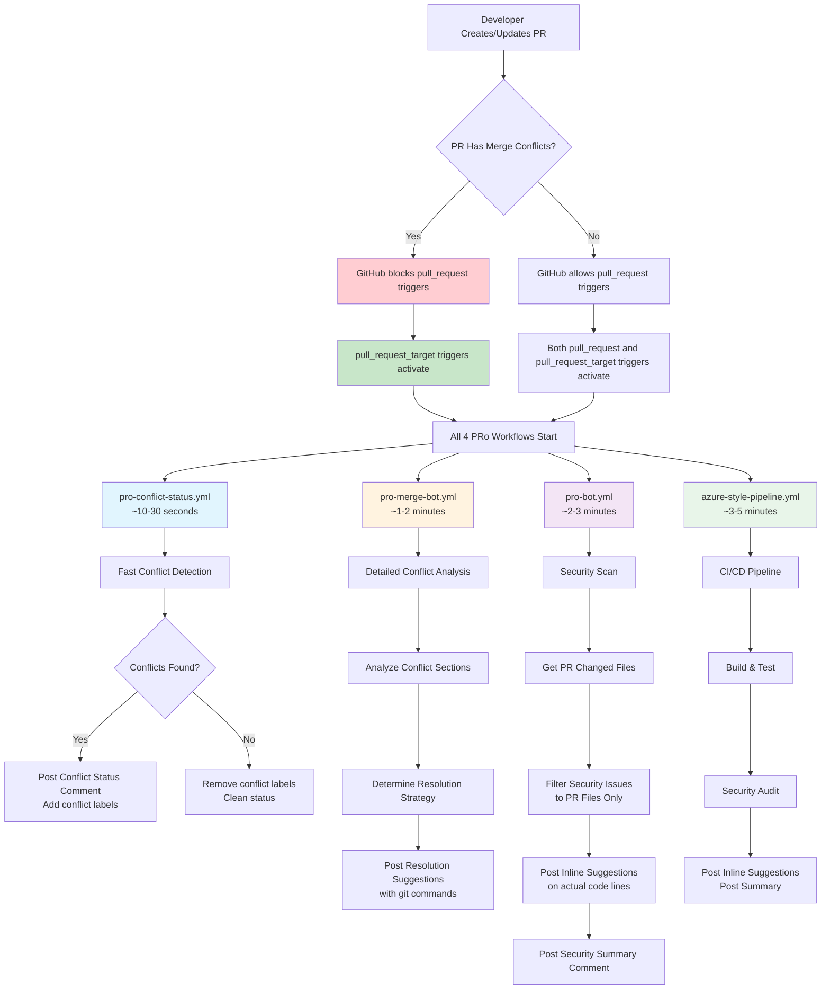
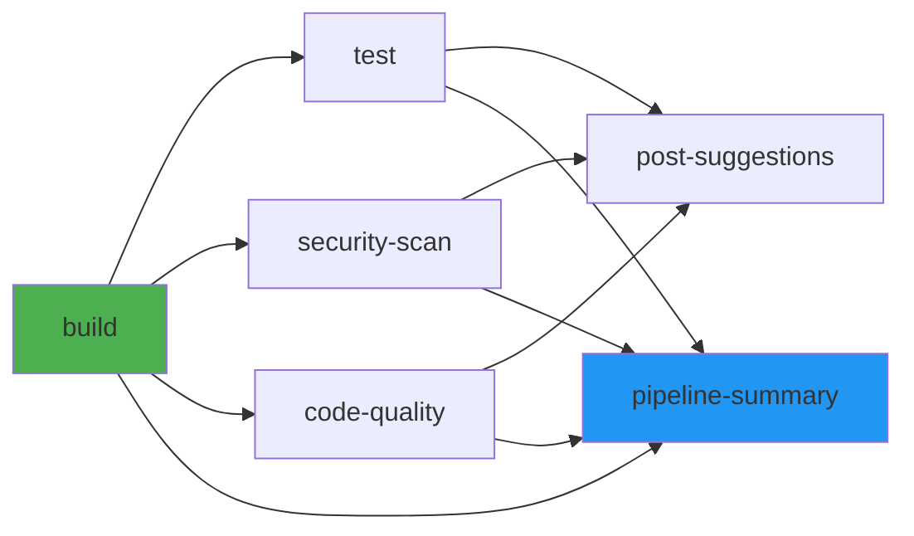
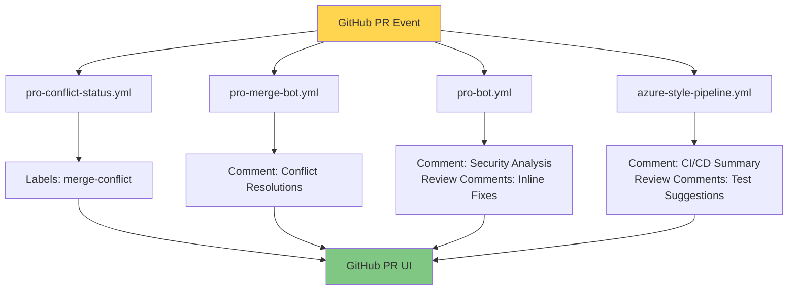

# PRo (PR Optimiser) Workflow Architecture

## Overview

PRo is an automated PR analysis system that provides security scanning, code quality checks, and intelligent merge conflict resolution. It consists of four workflows that work together to analyze pull requests and provide actionable feedback.

---

## Workflow Trigger Flow



---

## Workflow Details

### 1. **pro-conflict-status.yml** - Fast Conflict Detection

**Purpose**: Immediate feedback when conflicts exist

**Triggers**:
- `pull_request_target` only (bypasses GitHub's conflict blocking)
- Events: `opened`, `synchronize`, `reopened`

**Execution Time**: ~10-30 seconds

**Steps**:
1. Check PR mergeable state via GitHub API
2. Add labels: `merge-conflict`, `needs-resolution`
3. Create check run with `action_required` status
4. Post immediate notification comment

**Why Dual Triggers?**
- Only uses `pull_request_target` because it's optimized for speed
- Runs from base branch context (has access to secrets)
- Bypasses GitHub's workflow blocking when conflicts exist

---

### 2. **pro-merge-bot.yml** - Intelligent Merge Conflict Resolution

**Purpose**: Detailed conflict analysis with resolution strategies

**Triggers**:
- `pull_request_target` (runs even with conflicts)
- `pull_request` (runs when no conflicts)
- Events: `opened`, `synchronize`, `reopened`

**Execution Time**: ~1-2 minutes

**Steps**:
1. **Checkout repository** from PR head ref
2. **Check mergeable state** via GitHub API
3. **Attempt git merge** to detect conflicts
4. **Analyze conflict sections**:
   - Parse conflict markers (`<<<<<<<`, `=======`, `>>>>>>>`)
   - Extract code from both branches
5. **Determine resolution strategy**:
   - `accept-current`: Keep feature branch changes
   - `accept-base`: Keep main branch changes (security-preferred)
   - `merge-both`: Combine both sets of changes
   - `merge-config`: Use environment variables (for config files)
   - `regenerate`: Regenerate lock files
   - `manual`: Requires human review
6. **Post resolution suggestions**:
   - Collapsible sections per file
   - Recommended resolution code
   - Copy-paste ready git commands

**Resolution Strategy Logic**:

```javascript
// Config files - prefer secure environment variables
if (file === 'srv/config.js') {
  if (feature_has_hardcoded_credentials && main_has_env_vars) {
    return 'merge-config'; // Accept main's secure approach
  }
}

// Lock files - always regenerate
if (file.includes('package-lock.json')) {
  return 'regenerate';
}

// Workflow files - prefer main branch
if (file.includes('.github/workflows/')) {
  return 'accept-base';
}
```

---

### 3. **pro-bot.yml** - Security Vulnerability Scan

**Purpose**: Comprehensive security analysis with inline fix suggestions

**Triggers**:
- `pull_request_target` (runs even with conflicts)
- `pull_request` (runs when no conflicts)
- Events: `opened`, `synchronize`, `reopened`

**Execution Time**: ~2-3 minutes

**Steps**:
1. **Get PR files** via GitHub API
2. **Define security vulnerability database**:
   ```javascript
   const allVulnerabilities = [
     { severity: 'CRITICAL', name: 'Code Injection (eval)', file: 'srv/product-service.js', line: '52' },
     { severity: 'CRITICAL', name: 'Hardcoded Credentials', file: 'srv/config.js', line: '10-13' },
     // ... more vulnerabilities
   ];
   ```
3. **Filter to PR files only**:
   ```javascript
   const changedFiles = prFiles.map(f => f.filename);
   const vulnerabilities = allVulnerabilities.filter(v => 
     changedFiles.includes(v.file)
   );
   ```
4. **Post inline suggestions**:
   - GitHub review comments on specific lines
   - `````suggestion` blocks with fixed code
   - Commit suggestion button for one-click fixes
5. **Post security summary**:
   - Status: ✅ Pass or ⚠️ Issues Detected
   - Dynamic vulnerability tables (only PR files)
   - Severity counts (Critical, High, Medium)

**Inline Suggestion Format**:
```markdown
**🔴 CRITICAL SECURITY**: Code Injection via eval()

**Severity**: CRITICAL | **CVSS**: 9.8

````suggestion
    if (name) {
      const processedName = String(name).trim()
        .replace(/[<>"'`]/g, '')
        .substring(0, 100);
      req.data.name = processedName;
    }
````

*Commit this suggestion to fix the vulnerability.*
```

---

### 4. **azure-style-pipeline.yml** - CI/CD Build & Test Pipeline

**Purpose**: Azure DevOps-style pipeline with build, test, and security gates

**Triggers**:
- `pull_request_target` (runs even with conflicts)
- `pull_request` (runs when no conflicts)
- `workflow_dispatch` (manual trigger)
- Events: `opened`, `synchronize`, `reopened`

**Execution Time**: ~3-5 minutes

**Jobs**:

#### Job 1: **build** (Build & Dependency Check)
- Install dependencies (`npm ci`)
- Security audit (`npm audit`)
- Build application (`npm run build`)
- Deploy database (`npm run deploy`)
- **Failure on**: Critical vulnerabilities in dependencies

#### Job 2: **test** (Unit Tests & Coverage)
- Run tests with coverage
- Check coverage thresholds (70%)
- Post warnings if below threshold

#### Job 3: **security-scan** (Security Vulnerability Scan)
- Run SAST (Static Application Security Testing)
- Filter inline suggestions to PR files
- Post security report with:
  - Inline commit suggestions
  - Summary comment with severity breakdown

#### Job 4: **code-quality** (ESLint & Code Quality)
- Run ESLint
- Check code style
- Post quality suggestions

#### Job 5: **post-suggestions** (Non-blocking Suggestions)
- Test coverage suggestions
- Code quality improvements
- Quick wins (auto-fixes available)

#### Job 6: **pipeline-summary** (Summary Check)
- Aggregate all job results
- Only fails if `build` job fails
- Other failures are advisory only

**Pipeline Flow**:



---

## Key Technical Features

### 1. **Dual Trigger Strategy**

**Problem**: GitHub blocks `pull_request` workflows when PR has merge conflicts

**Solution**: Use both triggers

```yaml
on:
  pull_request_target:  # Runs from base branch, bypasses conflict block
    types: [opened, synchronize, reopened]
  pull_request:          # Runs from PR branch, blocked by conflicts
    types: [opened, synchronize, reopened]
```

**Benefits**:
- ✅ Workflows run even when conflicts exist
- ✅ `pull_request_target` has access to secrets
- ✅ Dual triggers ensure maximum coverage

### 2. **File Filtering for Security Analysis**

**Problem**: Showing vulnerabilities for files not in the PR confuses developers

**Solution**: Filter vulnerabilities to only PR files

```javascript
// Get PR files directly via API
const { data: prFiles } = await github.rest.pulls.listFiles({
  owner: context.repo.owner,
  repo: context.repo.repo,
  pull_number: prNumber
});
const changedFiles = prFiles.map(f => f.filename);

// Filter vulnerabilities
const vulnerabilities = allVulnerabilities.filter(v => 
  changedFiles.includes(v.file)
);
```

**Result**: Only relevant security issues shown

### 3. **Intelligent Conflict Resolution**

**Problem**: GitHub can't post review comments on conflict markers (they don't exist in committed code)

**Solution**: Parse conflict markers during merge test, post resolutions in PR comment

```javascript
// Attempt merge to trigger conflicts
git merge --no-commit --no-ff origin/main

// Parse conflict markers
if (line.startsWith('<<<<<<<')) {
  conflictStart = i;
} else if (line.startsWith('=======')) {
  conflictMiddle = i;
} else if (line.startsWith('>>>>>>>')) {
  conflictEnd = i;
  // Analyze conflict section
  analyzeConflict(currentSection, theirSection);
}
```

### 4. **Comment Cleanup**

All workflows delete old comments before posting new ones to avoid clutter:

```javascript
const { data: comments } = await github.rest.issues.listComments({
  owner: context.repo.owner,
  repo: context.repo.repo,
  issue_number: prNumber
});

for (const comment of comments) {
  if (comment.body.includes('🚀 PRo Analysis Report')) {
    await github.rest.issues.deleteComment({
      owner: context.repo.owner,
      repo: context.repo.repo,
      comment_id: comment.id
    });
  }
}
```

---

## Workflow Execution Timeline

```
Time    | Workflow                  | Action
--------|---------------------------|----------------------------------------
0s      | PR Created/Updated        | Developer pushes to PR branch
1s      | GitHub evaluates triggers | Checks for conflicts, determines which triggers fire
2s      | All 4 workflows start     | Parallel execution begins
10s     | pro-conflict-status       | ✅ Posts immediate conflict detection
60s     | pro-merge-bot             | 🔀 Posts detailed conflict resolutions
120s    | pro-bot                   | 🛡️ Posts security analysis with inline fixes
180s    | azure-style-pipeline      | 🔍 Posts CI/CD results and suggestions
```

---

## Data Flow Between Workflows

Workflows are **independent** - they don't share data directly:



Each workflow:
1. Fetches PR data independently via GitHub API
2. Performs its specific analysis
3. Posts its own comments/labels
4. No inter-workflow dependencies

---

## Comment Structure

### **pro-conflict-status.yml** → Quick Status
```markdown
🔍 PRo Conflict Detection

⚠️ This PR has merge conflicts

Status: action_required
Files with conflicts: 1
```

### **pro-merge-bot.yml** → Detailed Resolutions
```markdown
## 🔀 PRo Merge Conflict Analysis

### ⚠️ Conflicts Found
- `srv/config.js` (Line 7) - Accept main branch (secure config)

### 💡 Resolution Suggestions

<details>
<summary>srv/config.js</summary>

**Recommended**: Use environment variables (secure) ✅

**Resolution code**:
```javascript
environment: {
  nodeEnv: process.env.NODE_ENV || 'development',
  port: process.env.PORT || 4004
}
```

**To apply**:
```bash
git add srv/config.js
git commit -m "fix: resolve config conflict"
git push
```

</details>
```

### **pro-bot.yml** → Security Analysis
```markdown
## 🚀 PRo - PR Optimiser Analysis Report

**Status**: ⚠️ **Security Issues Detected**

This PR contains **5 security vulnerabilities**

## 🛡️ Security Vulnerabilities Summary

### Critical Severity (2)
| Severity | Vulnerability | File | Line | Inline Fix |
|----------|--------------|------|------|------------|
| 🔴 CRITICAL | Code Injection | srv/product-service.js | 52 | ✅ Posted |

> 💡 View inline fixes in the **Files changed** tab
```

### **azure-style-pipeline.yml** → CI/CD Results
```markdown
## 🔒 Security Analysis Summary

### 📊 Findings
- **High**: 2 issues detected

### 📍 Inline Suggestions
I've added 2 inline code suggestions on affected lines

**To apply**: Click "Commit suggestion" in Files changed tab
```

---

## Permissions Required

```yaml
permissions:
  contents: read         # Read repository files
  pull-requests: write   # Post comments, create review comments
  checks: write          # Create check runs
  issues: write          # Manage labels, comments
```

---

## Environment Variables & Secrets

All workflows use:
- `${{ secrets.GITHUB_TOKEN }}` - Automatically provided by GitHub Actions
- No custom secrets required
- All API calls use the built-in token

---

## Error Handling

Each workflow includes:

1. **Continue on error** for non-critical steps:
   ```yaml
   - name: Security Audit
     continue-on-error: true
   ```

2. **Try-catch blocks** in JavaScript:
   ```javascript
   try {
     await github.rest.pulls.createReviewComment(...);
   } catch (error) {
     console.log(`Failed to post: ${error.message}`);
   }
   ```

3. **Graceful degradation**: If one step fails, others continue

---

## Testing PRo Workflows

### Create Test PR with Conflicts:
```bash
# Create feature branch with intentional conflicts
git checkout -b test-pro-conflicts

# Edit srv/config.js to add hardcoded credentials
# Push and create PR

# PRo workflows will detect conflicts and post suggestions
```

### Expected Behavior:
1. **Immediate**: pro-conflict-status posts in ~10 seconds
2. **Detailed**: pro-merge-bot posts conflict resolutions in ~1 minute
3. **Security**: pro-bot posts security analysis in ~2 minutes
4. **CI/CD**: azure-style-pipeline posts build results in ~3 minutes

---

## Troubleshooting

### Workflows not running?
- ✅ Check workflows exist in `main` branch (GitHub only runs workflows from base branch)
- ✅ Verify triggers include both `pull_request` and `pull_request_target`
- ✅ Check GitHub Actions is enabled for the repository

### Comments not posting?
- ✅ Verify `pull-requests: write` permission
- ✅ Check for JavaScript errors in workflow logs
- ✅ Ensure `finalReviewBody` is a string (not array)

### Inline suggestions not showing?
- ✅ Verify files are actually changed in the PR
- ✅ Check line numbers match actual code
- ✅ Ensure commit SHA is correct (`pr.head.sha`)

---

## Architecture Benefits

1. **Resilient**: Runs even when GitHub blocks workflows (conflicts)
2. **Fast**: Parallel execution, immediate feedback
3. **Relevant**: Only shows issues for PR files
4. **Actionable**: One-click commit suggestions
5. **Non-blocking**: Only build failures block merge
6. **Clean**: Auto-deletes old comments

---

## Future Enhancements

- [ ] AI-powered code review using LLM
- [ ] Automatic conflict resolution (auto-merge safe conflicts)
- [ ] Performance regression detection
- [ ] Dependency update suggestions
- [ ] Security CVE database integration
- [ ] Custom vulnerability rules configuration

---

## References

- [GitHub Actions Documentation](https://docs.github.com/en/actions)
- [GitHub REST API](https://docs.github.com/en/rest)
- [OWASP Top 10](https://owasp.org/www-project-top-ten/)
- [Conventional Commits](https://www.conventionalcommits.org/)

---

**Version**: 1.0.0  
**Last Updated**: 2026-04-16  
**Maintained By**: PRo Team
